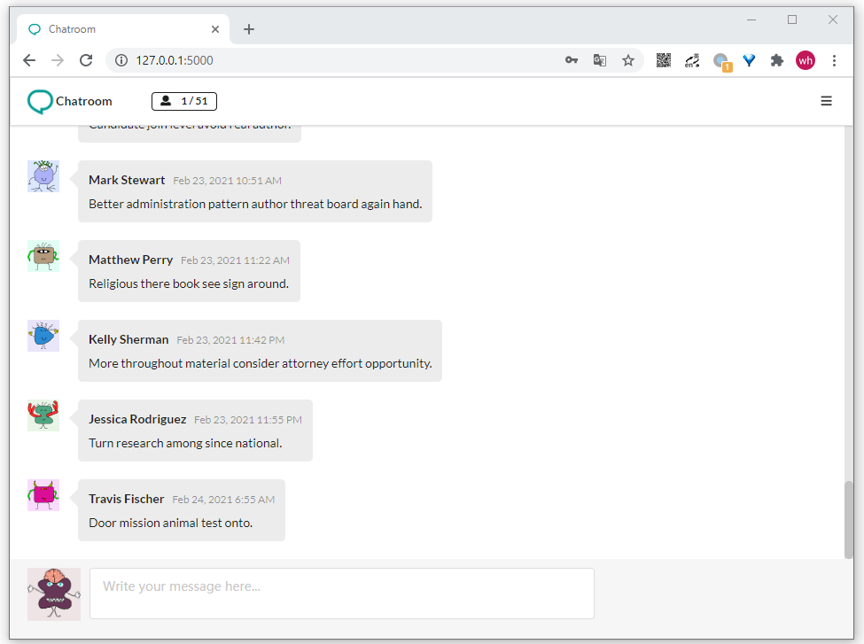
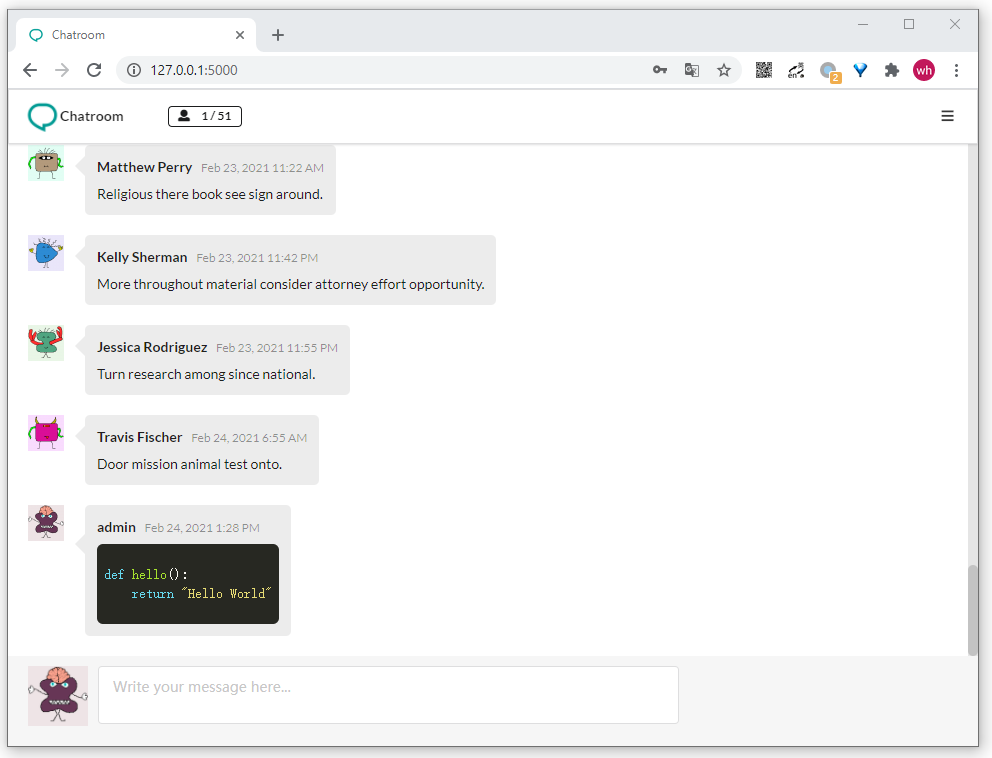
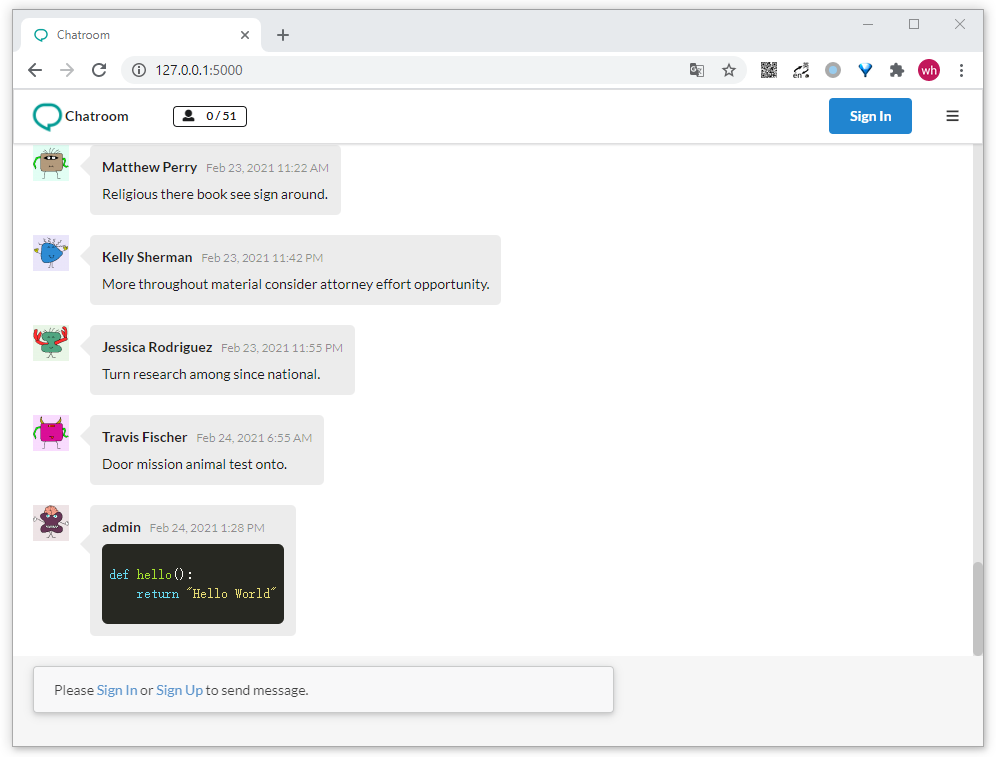
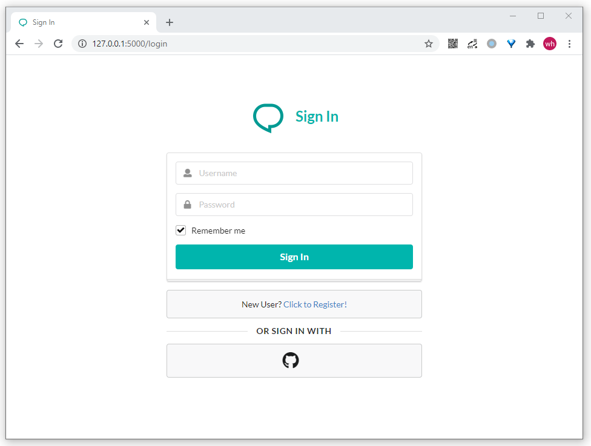
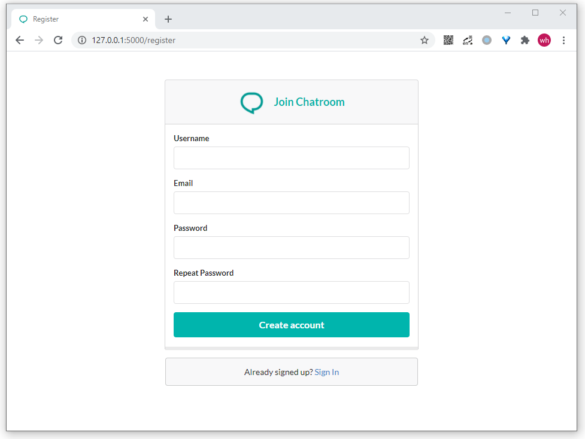
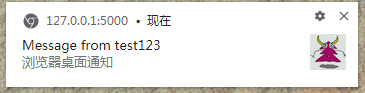

# Chatroom

基于 Flask 和 WebSocket 实现的聊天室程序


## 项目截图
- 主页:




- 代码语法高亮:




- 非登录状态的主页:




- 登录页面:




- 注册页面:




- 浏览器桌面通知:




## 项目功能
- Gravatar头像
- 实时双向通讯
- 第三方登录
- Markdown支持
- 代码语法高亮
- 标签页消息提醒
- 浏览器桌面通知


## 项目运行
```bash
# 克隆项目
$ git clone https://github.com/wtraceback/Chatroom.git
# 切换至目录
$ cd Chatroom
# 安装虚拟环境
$ python -m venv venv
# 启动虚拟环境
$ venv\Scripts\activate
# 安装依赖
$ pip install -r requirements.txt
# 生成虚拟数据
$ flask forge
# 运行项目
$ flask run
* Running on http://127.0.0.1:5000/
```


### 测试账户
- 用户名: `admin`
- 密码: `123456`


### 命令行
自定义命令:
- 删除旧数据库并创建新的空数据库: `flask initdb`
- 批量生成虚拟数据: `flask forge`
